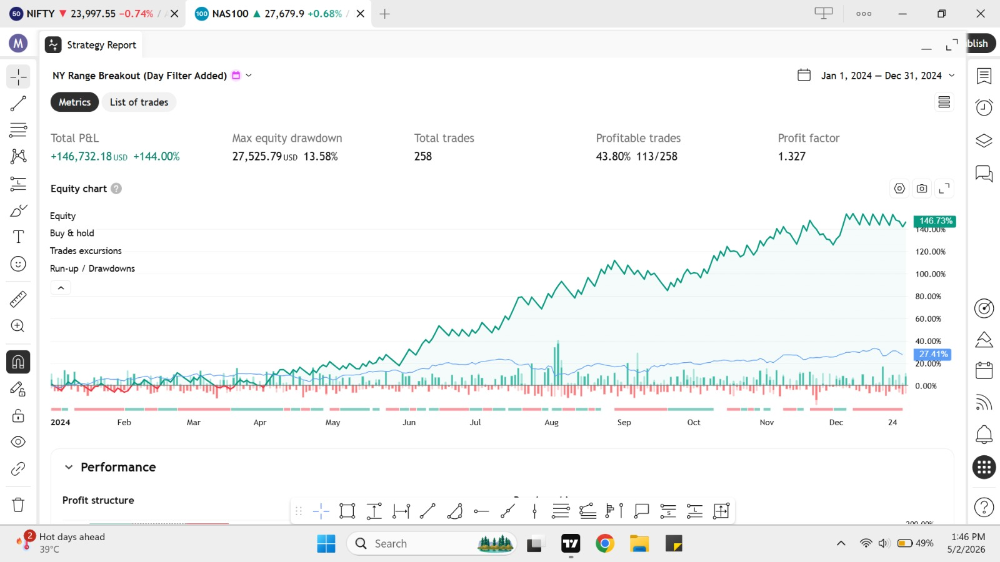

# ORB MT5 Automation System

## Overview

This project is a TradingView → MT5 automation system built using:

- Pine Script
- Python
- Flask
- MetaTrader5 API
- Ngrok

The system automatically executes MT5 trades when TradingView alerts are triggered.

---

## Features

- ORB (Opening Range Breakout) strategy
- Dynamic position sizing
- Automated stop loss & take profit
- TradingView webhook alerts
- MT5 automatic execution
- Flask API integration
- Buy / Sell / Close-All support

---

## Architecture

TradingView → Webhook → Flask API → MT5 API → Broker Execution

---

## Technologies Used

- TradingView Pine Script
- Python
- Flask
- MetaTrader5 Python API
- Ngrok

---

## Current Status

Working local automation infrastructure with MT5 integration and webhook execution.

---

## Sample Workflow

1. TradingView strategy generates signal
2. TradingView sends JSON webhook
3. Flask API receives payload
4. Python parses JSON
5. MT5 executes broker order automatically

---

## Future Improvements

- VPS deployment
- Multi-account execution
- Telegram/Discord integration
- Cloud deployment
- Dashboard monitoring
- Advanced trade management
## Strategy Performance

## Instrument Optimization

The ORB framework uses instrument-specific execution windows and parameter tuning.

### EURUSD
- Execution Window: 03:00 AM –03:15 AM NY local time
- Timeframe: 1 Minute
- Focus: Early session breakout volatility

### NAS100 CFD
- Execution Window: 09:15–09:30 AM NY local time
- Timeframe: 1 Minute
- Focus: US market opening range breakout

The framework dynamically handles:
- position sizing
- stop loss
- take profit
- webhook-based MT5 execution